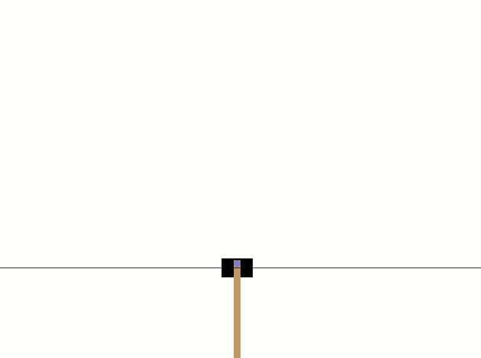
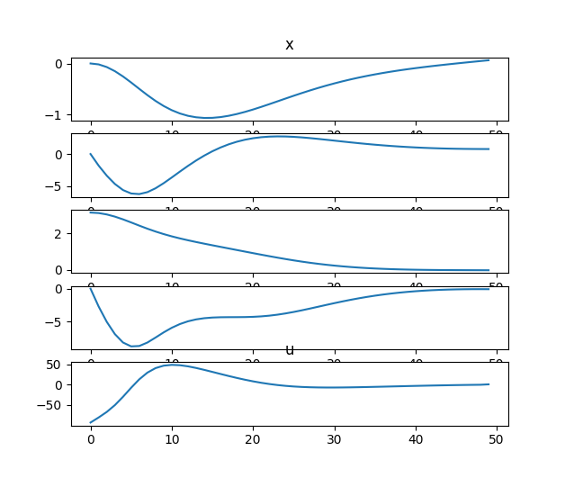
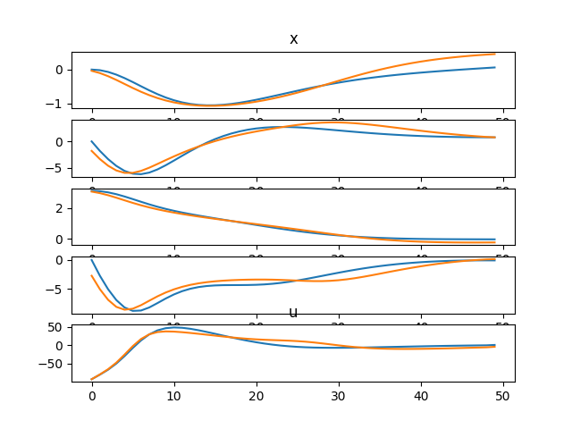

# Optimization-Control
This repository collect the most common optimization control / trajectory optimization algorithm.
Simulation was in a modified openai gym cartpole environment which support continuous action space.

## Dependency
gym  
casadi  
cvxopt  
cvxpy  

## Algorithm

LQR  
LQG  
ILQR  
ALILQR  
Convex MPC  
Shooting Method  
Collection Method  

## Some Result

## Reference

CMU 16 745
